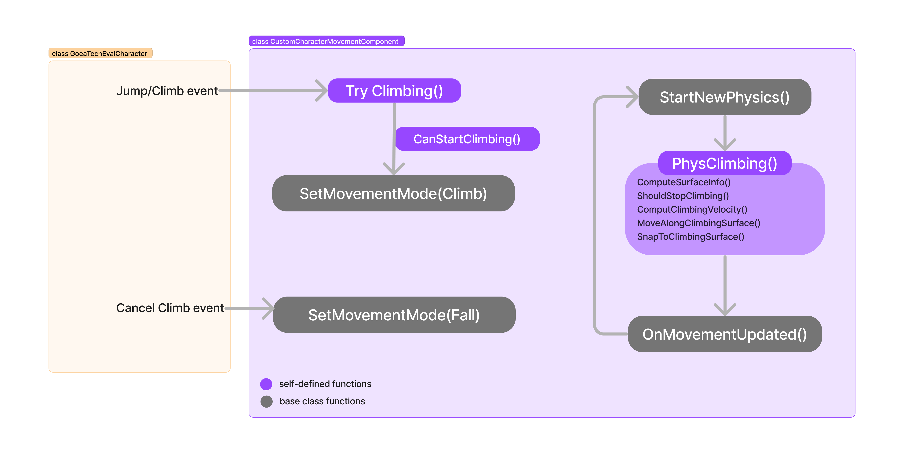
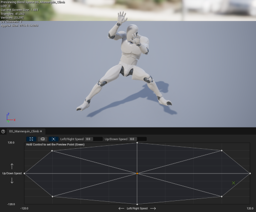
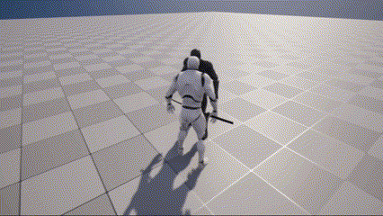
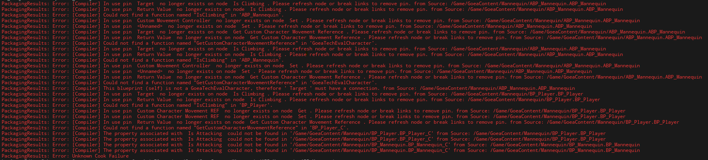

# Goea Technical Evaluation
## Instructions
### Objectives / Rules
To showcase the **climbing feature**, multiple objects (terrains) including walls, pillar, ceiling, ramps to test if the player can behave correctly when facing climbable/non-climbable objects.

Also, a Dummy character is placed inside the level that **reacts to attack**.

### Controls
- **Run**: press `W A S D` to make the player run in different directions.
- **Jump**: press `Space Bar` to start a jump.
- **Climb**: press `E` to try climbing. If there is a climbable surface in front of the player, he will climb.
- **Cancel Climb**: press `Q` to stop climbing.
- **Attack**: press `Left Mouse Button` to attack. The player will not be able to run, jump, or climb during attack.

## What I've Worked On
### Attack

- [x] The player should not be able to jump while attacking.
- [x] The player should not freely move while attacking.
    - The above are implemented by setting `isAttacking = true` inside Player's blueprint. Inside C++ action callback functions such as `AGoeaTechEvalCharacter::MoveForward()`, actions are blocked by condition `if(IsAttacking)`.
- [x] The player should not be able to attack when climbing.
- [x] Spamming the attack does not cancel itself.
    - This is done my wrapping a `Do once` node around attack logics. It will be reset after attack montage has completed playing. 
- [x] Feedbacks while attacking:
    - Plays __Sword Whoosh sfx__ when whipping the sword.
    - Plays __Impact Sword_to_body sfx__ when Dummy is attacked.
    - Applied __Camera shake__ when Dummy is attacked.
    - Dummy plays __On Damage montage__ when attacked and steps back due to root motion.

### Climbing
The climbing feature is created **completely in C++** inside my `UCustomCharacterMovementComponent` that inherits the `CharacterMovementComponent` class.

#### Structure overview

- Detecting surfaces: Use **shape sweep** on every tick to detect collisions in front of the player.
- `CanStartClimbing()`: Check if the collision(s) in front of the player is a climbable surface. Criterias for climbable surfaces are described below. 
- `PhysClimbing()`: Handles climbing velocity, acceleration, movement, and collsion.
- `ComputeSurfaceInfo()`: Calculates `CurrentClimbingNormal` and `CurrentClimbingPosition` by averaging all colliding surfaces normals and hit positions.
- `ShouldStopClimbing`: Checks if (player cancels climb event) || (no climbable surface) || (player is on ceiling/floor).
- `ComputeClimbingVelocity()`: Calculates velocity by calling `CalcVelocity()` from base class if not controlled by root motion.
- `MoveAlongClimbingSurface()`: Move the character by calling `SafeMoveUpdatedComponent()` and make the player look towards the surface normal.
- `SnapToClimbingSurface()`: Move the character towards the surface.

**Climbable criterias**: 
1. Player __should__ be looking at a maximum `MaxHorizontalDegreesToStartClimbing = 30.f` degrees in order to climb the surface.
2. Player __should not__ be able to climb on ceilings or floors (i.e., surface normal is nearly same direction as world up-direction.)
3. Player __should not__ be able to climb objects that are lower than it's eye height. Calls `IsFacingSurface()` to **line-trace** forward at eye height to check if hitting the object.
4. Player __should not__ be able to climb on other characters.

>Red objects and character are unclimbable.

### Others
- Climbing animations using **Blendspace**

- Added **sound effects** for running, attacking, and climbing.
- Dummy character always faces player when distance between them `<= 500`. (Implemented inside Blueprint)
- Dummy character plays **attacked montage** and steps back due to root motion. (Implemented inside Blueprint)

## Issues / Bugs
- Dummy sometimes teleports when attacked
    - Possible cause: 
        Collision setting and root motion. Both Player and Dummy are set to preset object type __Pawn__ , thus probably making the Dummy to be "pushed" by player's right arm and the root motion cannot behave as expected. \
 
- Compile error when project packaging. Error messages shows that the issue are related to my `CustomCharacterMovementComponent`.

- Player cannot move after Unreal crashes or other random events. 
    - This issue can be fixed by recreating a new player blurprint and replicating every component and settings. However, it appeared multiple times and it is time consuming to recreate and reset the character everytime.

## Future Improvements
- Add more climbing assets for smooth ground-to-wall/wall-to-ground/wall-to-wall transition.
- Detect when to climb up ledges/roof and use root motion to move itself up.
- Weapon/footstep sfx are hardcoded in animation assets. Should be able to consider material of collided object to play different sfx.